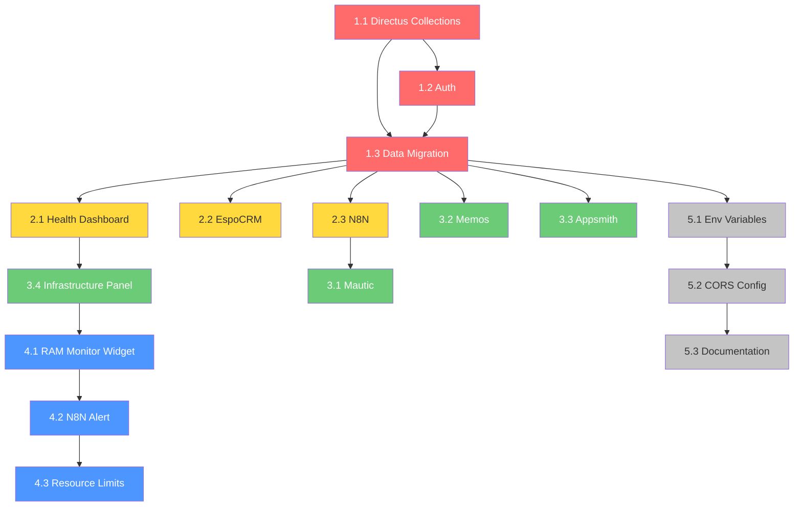

# Freelancer Workspace — Tích hợp hệ thống VPS tinhgon.com

> **Dự án:** Tích hợp Freelancer Workspace (React 19 + Vite 6 + Tailwind 4) với toàn bộ hệ thống Docker services trên VPS
> **Project Type:** WEB (Frontend SPA) + INFRASTRUCTURE (Docker/DevOps)
> **Trạng thái hiện tại:** ✅ Đã deploy thành công tại https://workspace.tinhgon.com/

---

## Overview

Freelancer Workspace đã chạy thành công trên VPS `190.102.110.208:2287` (Ubuntu + Webinoly) tại `/opt/freelancer-workspace`, truy cập qua `workspace.tinhgon.com`. 

**Mục tiêu:** Biến workspace thành **trung tâm điều hành tập trung** — tích hợp dữ liệu từ 8 services Docker đang chạy, thêm authentication cho team nhỏ (2-5 người), kết nối Directus làm backend API, và thiết lập monitoring/alert RAM.

---

## Kiến trúc hệ thống hiện tại

```
VPS 190.102.110.208 (Ubuntu, 32GB RAM)
├── Webinoly (Reverse Proxy + SSL)
├── Docker Network: sysadmin_net
│
├── 📊 Freelancer Workspace ── /opt/freelancer-workspace ── workspace.tinhgon.com
├── ⚙️ N8N ─────────────────── /root/n8n-docker ───────── automation.tinhgon.com
├── 🗄️ Databasement ─────────── /opt/databasement ─────── db.tinhgon.com
├── 📋 Appsmith ──────────────── /opt/appsmith ──────────── dashboard.tinhgon.com
├── 🔌 Directus ──────────────── /opt/landing-system/directus ── api-builder.tinhgon.com / builder.tinhgon.com
├── 📝 Memos ─────────────────── /opt/memos ────────────── notes.tinhgon.com
├── 🏠 Homepage ──────────────── /opt/homepage ─────────── home.tinhgon.com
├── 📈 Glances ───────────────── /opt/glances ──────────── glances.tinhgon.com
├── 🐳 Portainer ─────────────── /opt/portainer ────────── portainer.tinhgon.com
├── 👥 EspoCRM ───────────────── /opt/espocrm ──────────── evisacrm.tinhgon.com
├── 💬 Chatwoot ──────────────── /opt/chatwoot ─────────── chat.evisavietnamservice.com
├── 📧 Mautic ────────────────── /opt/mautic ───────────── mautic.evisavietnamservice.com
│
├── [Ngoài Docker]
├── 🌐 eVisa Backend (Laravel) ── backend.evisavietnamservice.com
└── 🌐 eVisa Frontend (WP+Woo) ── evisavietnamservice.com
```

---

## Success Criteria

| # | Tiêu chí | Đo lường |
|---|----------|----------|
| 1 | Dashboard hiển thị health check tất cả services | ✅ 12/12 services trả về status |
| 2 | Authentication hoạt động (Directus auth) | ✅ Login/logout + phân quyền 2-5 users |
| 3 | CRM panel đồng bộ dữ liệu từ EspoCRM | ✅ Hiển thị contacts, deals real-time |
| 4 | N8N workflows xem/trigger từ workspace | ✅ List + execute workflows |
| 5 | Directus là data layer cho projects, contracts | ✅ CRUD hoạt động |
| 6 | Appsmith dashboards embed thành công | ✅ iFrame/embed hiển thị đúng |
| 7 | Mautic campaigns hiển thị trong workspace | ✅ Xem campaigns, contacts |
| 8 | Memos tích hợp vào workspace notes | ✅ Đọc/ghi memos |
| 9 | Infrastructure panel từ Portainer API | ✅ Container status, restart |
| 10 | RAM monitoring + alert khi > 80% | ✅ Glances data + notification |

---

## Tech Stack

| Layer | Công nghệ | Lý do |
|-------|-----------|-------|
| **Frontend** | React 19 + Vite 6 + Tailwind 4 | Giữ nguyên upstream stack |
| **Backend/API** | Directus (đã có) | Headless CMS, REST + GraphQL, auth built-in, đã chạy trên VPS |
| **Auth** | Directus Authentication | Tận dụng user system sẵn có, JWT tokens |
| **Docker** | Docker Compose + sysadmin_net | Giữ nguyên hạ tầng hiện tại |
| **Proxy** | Webinoly | Đã quản lý SSL cho tất cả domains |
| **Monitoring** | Glances API + N8N alerts | Đã có sẵn, chỉ cần tích hợp |

---

## File Structure (Thay đổi so với upstream)

```
freelancer-workspace-tinhgon/
├── src/
│   ├── ThompBui.jsx                    # Main app (existing)
│   ├── main.jsx                        # Entry point (existing)
│   ├── index.css                       # Global styles (existing)
│   │
│   ├── services/                       # [NEW] API integration layer
│   │   ├── api.js                      # Base HTTP client (axios/fetch wrapper)
│   │   ├── directus.js                 # Directus SDK client + auth
│   │   ├── n8n.js                      # N8N API client
│   │   ├── espocrm.js                  # EspoCRM REST API client
│   │   ├── portainer.js                # Portainer API client
│   │   ├── glances.js                  # Glances REST API client
│   │   ├── mautic.js                   # Mautic API client
│   │   ├── memos.js                    # Memos API client
│   │   └── healthcheck.js              # Health check aggregator
│   │
│   ├── components/                     # Existing + new integration components
│   │   ├── integrations/               # [NEW] Integration panels
│   │   │   ├── ServiceHealthDashboard.jsx
│   │   │   ├── N8NWorkflowPanel.jsx
│   │   │   ├── EspoCRMPanel.jsx
│   │   │   ├── AppsmithEmbed.jsx
│   │   │   ├── MauticCampaignPanel.jsx
│   │   │   ├── MemosPanel.jsx
│   │   │   ├── InfrastructurePanel.jsx
│   │   │   └── GlancesMonitor.jsx
│   │   ├── auth/                       # [NEW] Authentication
│   │   │   ├── LoginPage.jsx
│   │   │   ├── AuthProvider.jsx
│   │   │   └── ProtectedRoute.jsx
│   │   └── ... (existing components)
│   │
│   ├── hooks/                          # Existing + new hooks
│   │   ├── useDirectus.js              # [NEW] Directus data hooks
│   │   ├── useHealthCheck.js           # [NEW] Service monitoring hooks
│   │   └── ... (existing hooks)
│   │
│   ├── config/                         # Existing + new configs
│   │   ├── services.js                 # [NEW] Service URLs & API keys config
│   │   └── ... (existing configs)
│   │
│   └── ... (existing directories)
│
├── docker-compose.yml                  # [MODIFY] Nếu cần thêm env vars
├── Dockerfile                          # [EXISTING] Multi-stage build
├── .env.production                     # [NEW] Production environment variables
├── nginx.conf                          # [EXISTING/MODIFY] Nginx config for SPA
└── docs/
    └── INTEGRATION_GUIDE.md            # [NEW] Hướng dẫn tích hợp services
```

---

## Task Breakdown

### 🔴 PHASE 1: Foundation — Auth + Directus Data Layer (Ưu tiên cao nhất)

#### Task 1.1: Thiết lập Directus Collections cho Workspace
- **Agent:** `backend-specialist`
- **Skill:** `database-design`, `api-patterns`
- **INPUT:** Directus instance tại api-builder.tinhgon.com
- **OUTPUT:** Collections: `workspace_users`, `projects`, `clients`, `contracts`, `infrastructure_items` được tạo trong Directus
- **VERIFY:** 
  - `curl https://api-builder.tinhgon.com/items/projects` trả về 200
  - Directus admin panel hiển thị collections mới
- **Rollback:** Xóa collections qua Directus admin

#### Task 1.2: Authentication với Directus
- **Agent:** `frontend-specialist` + `security-auditor`
- **Skill:** `clean-code`, `frontend-design`
- **INPUT:** Directus auth API endpoint
- **OUTPUT:** 
  - `src/services/directus.js` — Directus SDK client
  - `src/components/auth/LoginPage.jsx` — Trang đăng nhập
  - `src/components/auth/AuthProvider.jsx` — React Context cho auth state
  - `src/components/auth/ProtectedRoute.jsx` — Route guard
- **VERIFY:** 
  - Login với Directus user → nhận JWT token
  - Truy cập `/projects` khi chưa login → redirect tới `/login`
  - Token refresh hoạt động
- **Rollback:** Revert auth components, app chạy lại không cần login

#### Task 1.3: Migrate data layer từ localStorage sang Directus API
- **Agent:** `frontend-specialist`
- **Skill:** `api-patterns`, `clean-code`
- **Dependencies:** Task 1.1, 1.2
- **INPUT:** Existing localStorage data functions trong `src/data/`
- **OUTPUT:**
  - `src/services/api.js` — Base fetch wrapper với auth headers
  - Cập nhật `src/hooks/` để gọi Directus API thay vì localStorage
  - Fallback: nếu API fail → dùng localStorage cache
- **VERIFY:**
  - Tạo project mới → xuất hiện trong Directus admin
  - Refresh page → data persist (không mất khi clear localStorage)
  - Offline fallback hoạt động
- **Rollback:** Feature flag toggle giữa localStorage và API mode

---

### 🟡 PHASE 2: Service Integrations — Dashboard + CRM + N8N

#### Task 2.1: Service Health Dashboard
- **Agent:** `frontend-specialist`
- **Skill:** `frontend-design`, `api-patterns`
- **INPUT:** 12 service URLs (xem kiến trúc ở trên)
- **OUTPUT:**
  - `src/services/healthcheck.js` — Ping 12 services, cache kết quả
  - `src/components/integrations/ServiceHealthDashboard.jsx` — Grid hiển thị status
  - Tích hợp vào trang Overview (Dashboard)
- **VERIFY:**
  - Dashboard hiển thị 12 cards với status (🟢 online / 🔴 offline / 🟡 slow)
  - Auto-refresh mỗi 60 giây
  - Click card → mở link tới service domain
- **Rollback:** Ẩn dashboard widget, Overview trở lại giao diện cũ

#### Task 2.2: EspoCRM Integration (CRM Panel)
- **Agent:** `frontend-specialist`
- **Skill:** `api-patterns`
- **INPUT:** EspoCRM API tại evisacrm.tinhgon.com
- **OUTPUT:**
  - `src/services/espocrm.js` — EspoCRM REST client (API Key auth)
  - `src/components/integrations/EspoCRMPanel.jsx` — Hiển thị contacts, deals, activities
  - Tích hợp vào CRM tab hiện tại
- **VERIFY:**
  - CRM panel hiển thị danh sách contacts từ EspoCRM
  - Tìm kiếm contact hoạt động
  - Click contact → mở chi tiết
- **Rollback:** CRM tab dùng demo data như trước

#### Task 2.3: N8N Workflow Integration
- **Agent:** `frontend-specialist`
- **Skill:** `api-patterns`
- **INPUT:** N8N API tại automation.tinhgon.com
- **OUTPUT:**
  - `src/services/n8n.js` — N8N API client
  - `src/components/integrations/N8NWorkflowPanel.jsx` — List workflows, trigger, xem execution log
- **VERIFY:**
  - Hiển thị danh sách workflows (active/inactive)
  - Trigger workflow → N8N nhận và chạy
  - Execution history hiển thị đúng
- **Rollback:** Ẩn N8N panel

---

### 🟢 PHASE 3: Extended Integrations — Mautic + Memos + Appsmith + Infrastructure

#### Task 3.1: Mautic Campaign Panel
- **Agent:** `frontend-specialist`
- **Skill:** `api-patterns`
- **INPUT:** Mautic API tại mautic.evisavietnamservice.com
- **OUTPUT:**
  - `src/services/mautic.js` — Mautic API client (OAuth2)
  - `src/components/integrations/MauticCampaignPanel.jsx` — Campaigns, contacts, stats
- **VERIFY:** Hiển thị campaigns + click-through stats
- **Rollback:** Ẩn Mautic panel

#### Task 3.2: Memos Integration
- **Agent:** `frontend-specialist`
- **INPUT:** Memos API tại notes.tinhgon.com
- **OUTPUT:**
  - `src/services/memos.js` — Memos API client
  - `src/components/integrations/MemosPanel.jsx` — Read/write memos
- **VERIFY:** Tạo memo → hiển thị trên notes.tinhgon.com
- **Rollback:** Ẩn Memos widget

#### Task 3.3: Appsmith Dashboard Embed
- **Agent:** `frontend-specialist`
- **INPUT:** Appsmith tại dashboard.tinhgon.com
- **OUTPUT:**
  - `src/components/integrations/AppsmithEmbed.jsx` — Secure iframe embed
  - CSP headers cho phép embed từ dashboard.tinhgon.com
- **VERIFY:** Appsmith dashboard render đúng trong workspace
- **Rollback:** Ẩn Appsmith tab

#### Task 3.4: Infrastructure Panel (Portainer + Glances)
- **Agent:** `frontend-specialist` + `security-auditor`
- **Skill:** `api-patterns`, `server-management`
- **INPUT:** Portainer API + Glances API
- **OUTPUT:**
  - `src/services/portainer.js` — Container management
  - `src/services/glances.js` — System metrics
  - `src/components/integrations/InfrastructurePanel.jsx` — Container list + restart
  - `src/components/integrations/GlancesMonitor.jsx` — RAM/CPU/Disk charts
- **VERIFY:**
  - Container list hiển thị đúng
  - RAM usage chart cập nhật real-time
  - Restart container hoạt động
- **Rollback:** Infrastructure tab dùng static demo data

---

### 🔵 PHASE 4: Monitoring + Alert + RAM Optimization

#### Task 4.1: RAM Monitoring Dashboard Widget
- **Agent:** `frontend-specialist`
- **Dependencies:** Task 3.4
- **INPUT:** Glances API data
- **OUTPUT:**
  - Real-time RAM chart trên Overview page
  - Threshold line tại 80% (25.6GB)
  - Color coding: green < 60%, yellow 60-80%, red > 80%
- **VERIFY:** Widget hiển thị RAM đúng so với `htop` trên VPS

#### Task 4.2: N8N Alert Workflow khi RAM > 80%
- **Agent:** `backend-specialist`
- **Skill:** `server-management`
- **Dependencies:** N8N đang chạy
- **INPUT:** Glances API endpoint
- **OUTPUT:**
  - N8N workflow: Poll Glances mỗi 5 phút → If RAM > 80% → Send alert (Telegram/Email)
  - Webhook endpoint để workspace trigger manual check
- **VERIFY:**
  - Tạm tăng RAM usage → nhận alert
  - Manual trigger từ workspace → alert gửi đi
- **Rollback:** Disable N8N workflow

#### Task 4.3: Docker Container Resource Limits
- **Agent:** `backend-specialist`
- **Skill:** `server-management`, `deployment-procedures`
- **INPUT:** docker-compose.yml của tất cả services
- **OUTPUT:**
  - Thêm `mem_limit` cho mỗi container
  - Recommended allocation:
    - Freelancer Workspace: 512MB
    - N8N: 1GB
    - Directus: 1GB
    - Appsmith: 2GB
    - EspoCRM: 1GB
    - Chatwoot: 2GB
    - Mautic: 1GB
    - Others: 512MB each
    - System reserved: ~4GB
- **VERIFY:** `docker stats` hiển thị limits

---

### ⚪ PHASE 5: Environment Configuration + Documentation

#### Task 5.1: Environment Variables (.env.production)
- **Agent:** `backend-specialist` + `security-auditor`
- **OUTPUT:**
  ```env
  # Directus (Backend API + Auth)
  VITE_DIRECTUS_URL=https://api-builder.tinhgon.com
  
  # Service URLs
  VITE_N8N_URL=https://automation.tinhgon.com
  VITE_ESPOCRM_URL=https://evisacrm.tinhgon.com
  VITE_PORTAINER_URL=https://portainer.tinhgon.com
  VITE_GLANCES_URL=https://glances.tinhgon.com
  VITE_MAUTIC_URL=https://mautic.evisavietnamservice.com
  VITE_MEMOS_URL=https://notes.tinhgon.com
  VITE_APPSMITH_URL=https://dashboard.tinhgon.com
  VITE_CHATWOOT_URL=https://chat.evisavietnamservice.com
  
  # Feature Flags
  VITE_ENABLE_AUTH=true
  VITE_ENABLE_CRM_SYNC=true
  VITE_ENABLE_N8N_PANEL=true
  VITE_ENABLE_MONITORING=true
  ```
- **VERIFY:** `npm run build` thành công, env vars inject đúng

#### Task 5.2: CORS Configuration cho các services
- **Agent:** `backend-specialist`
- **INPUT:** Tất cả services cần cho phép origin `workspace.tinhgon.com`
- **OUTPUT:**
  - Cập nhật CORS settings cho: Directus, N8N, EspoCRM, Memos, Mautic
  - Hoặc: Thêm reverse proxy rule trong Webinoly/Nginx để proxy API calls
- **VERIFY:** Browser console không có CORS errors

#### Task 5.3: Integration Documentation
- **Agent:** `project-planner`
- **OUTPUT:** `docs/INTEGRATION_GUIDE.md` — Hướng dẫn:
  - Cách thêm service mới
  - API key management
  - Troubleshooting CORS
  - Docker network diagram

---

## Dependency Graph



---

## Parallel Execution Plan

| Giai đoạn | Tasks song song | Điều kiện |
|-----------|-----------------|-----------|
| Phase 1 | 1.1 (Directus) ‖ 1.2 (Auth UI) | Task 1.1 & 1.2 song song, 1.3 chờ cả hai |
| Phase 2 | 2.1 ‖ 2.2 ‖ 2.3 | Cả 3 task độc lập, chạy song song |
| Phase 3 | 3.1 ‖ 3.2 ‖ 3.3 ‖ 3.4 | Cả 4 task độc lập |
| Phase 4 | 4.1 → 4.2 → 4.3 | Sequential (phụ thuộc lẫn nhau) |
| Phase 5 | 5.1 → 5.2 → 5.3 | Sequential |

---

## Risk Assessment

| Rủi ro | Xác suất | Impact | Giảm thiểu |
|--------|----------|--------|------------|
| CORS blocking API calls | Cao | Cao | Dùng Nginx reverse proxy `/api/*` thay vì gọi trực tiếp |
| RAM overflow khi thêm service | Trung bình | Cao | Thiết lập `mem_limit` + monitoring trước khi tích hợp |
| Directus API rate limiting | Thấp | Trung bình | Client-side caching + debounce |
| EspoCRM API auth complexity | Trung bình | Trung bình | Dùng API key thay vì OAuth |
| Service downtime ảnh hưởng workspace | Trung bình | Thấp | Graceful fallback + error boundaries |
| Breaking upstream updates | Thấp | Cao | Giữ fork sync, tích hợp qua separate modules |

---

## Estimated Timeline

| Phase | Thời gian | Milestone |
|-------|-----------|-----------|
| Phase 1 | 3-5 ngày | Auth + Data layer hoạt động |
| Phase 2 | 3-4 ngày | Dashboard + CRM + N8N live |
| Phase 3 | 3-4 ngày | Full integration suite |
| Phase 4 | 2-3 ngày | Monitoring + alerts |
| Phase 5 | 1-2 ngày | Config + docs |
| **Tổng** | **12-18 ngày** | **Production-ready workspace** |

---

## Phase X: Verification Checklist

- [ ] Tất cả services trả về status trên Health Dashboard
- [ ] Login/Logout hoạt động với Directus auth
- [ ] Data persist qua Directus (không mất khi refresh)
- [ ] CRM hiển thị data từ EspoCRM
- [ ] N8N workflows xem/trigger thành công
- [ ] Appsmith dashboard embed đúng
- [ ] Mautic campaigns hiển thị
- [ ] Memos read/write hoạt động
- [ ] Infrastructure panel hiển thị containers
- [ ] RAM monitoring widget cập nhật real-time
- [ ] N8N alert trigger khi RAM > 80%
- [ ] Docker `mem_limit` thiết lập cho tất cả containers
- [ ] CORS không có errors
- [ ] `npm run build` thành công
- [ ] Mobile responsive
- [ ] No CORS errors in browser console
- [ ] Security: API keys không expose trong client bundle
- [ ] Documentation hoàn chỉnh

---

## Done When

- [ ] workspace.tinhgon.com hiển thị Dashboard với health check 12/12 services
- [ ] Team 2-5 người login được và làm việc đồng thời
- [ ] Tất cả 8 integration panels hoạt động
- [ ] RAM alert tự động thông báo khi quá tải
- [ ] Docs/INTEGRATION_GUIDE.md hoàn chỉnh
